🚗 Parabrisas Vásquez


------------------------------------------------------------------------------------------------------------------

📖 Descripción

**Parabrisas Vásquez** es un proyecto académico enfocado en el desarrollo **Front-End** de una plataforma web para una empresa dedicada al reemplazo, instalación y reparación de parabrisas y vidrios automotrices.

El objetivo principal fue diseñar una interfaz moderna, clara y escalable, orientada a mejorar la presencia digital de la empresa y facilitar la navegación de los usuarios por sus servicios principales.

El proyecto fue desarrollado utilizando **HTML5, CSS3 y JavaScript**, organizando las vistas, estilos, scripts e imágenes de forma modular para facilitar su mantenimiento y futuras mejoras.

Durante el desarrollo, las páginas fueron visualizadas y probadas mediante **Live Server** en Visual Studio Code.

> ⚠️ El Back-End quedó pendiente para una futura versión.  
> La estructura inicial con Node.js, Express y MongoDB fue planteada, pero no fue finalizada ni integrada completamente.

---------------------------------------------------------------------------------------------------------------

## 🖼️ Capturas del proyecto

### 🏠 Página de Inicio

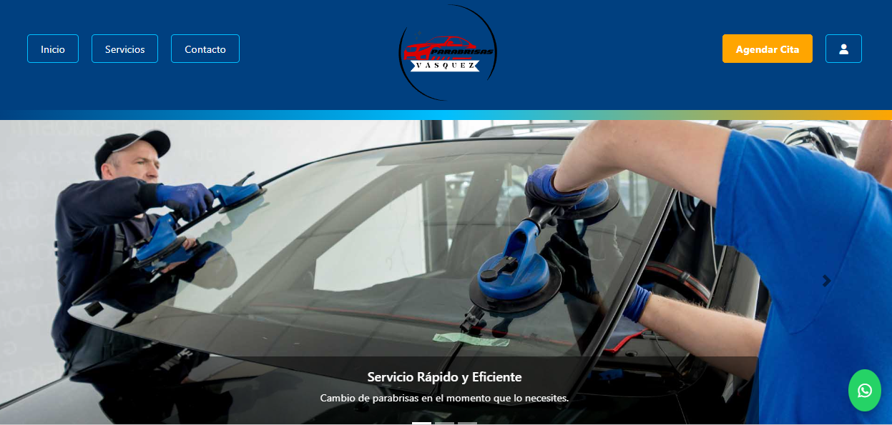

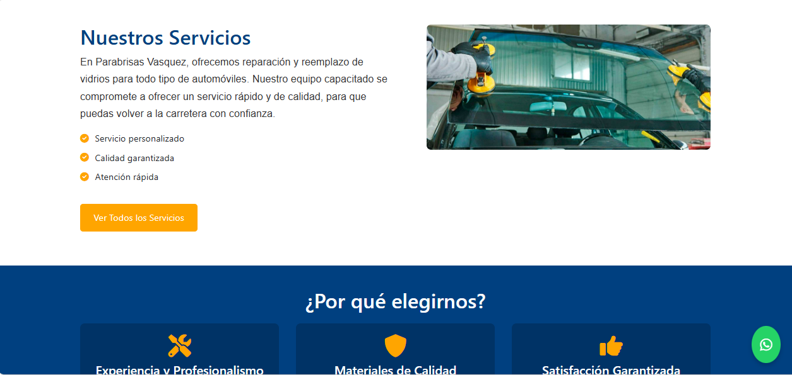

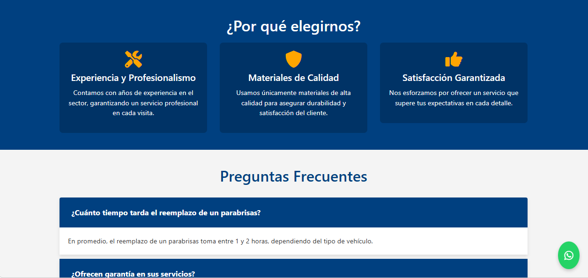

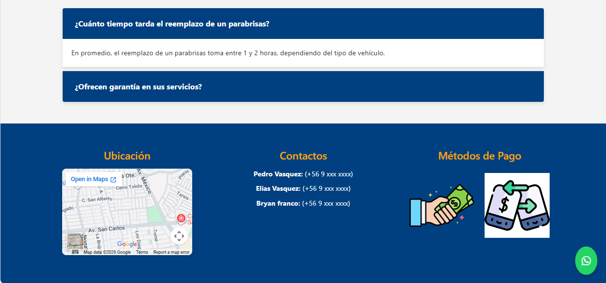

---

### 🔧 Servicios

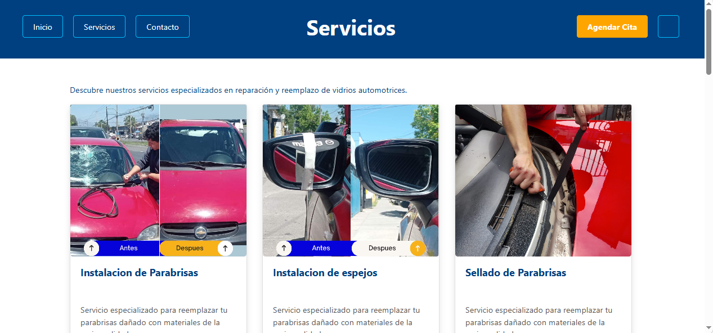

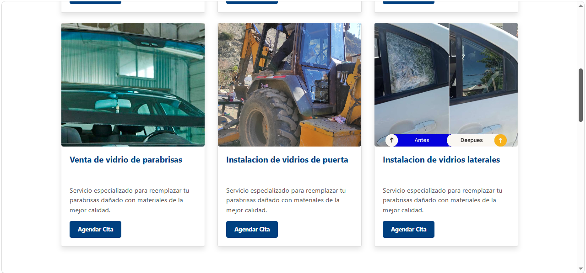


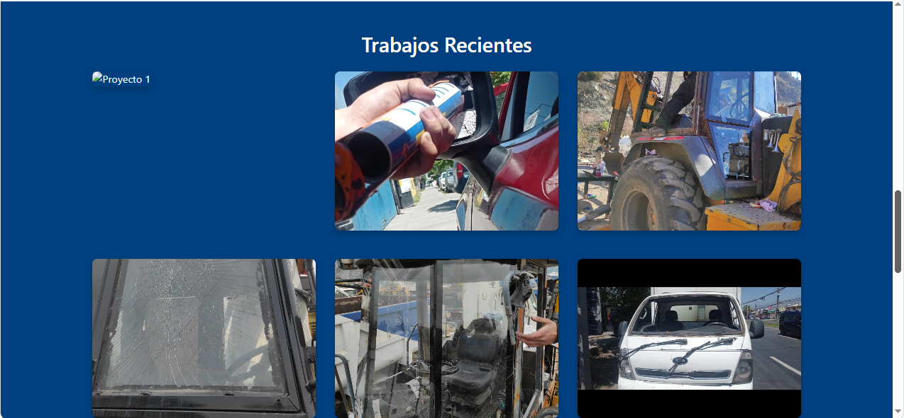

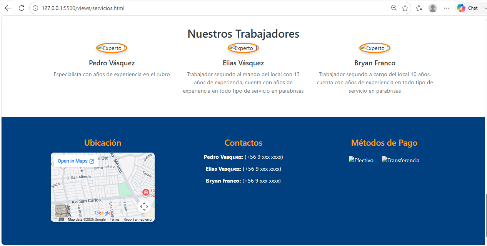

---

### 📅 Agendamiento de citas

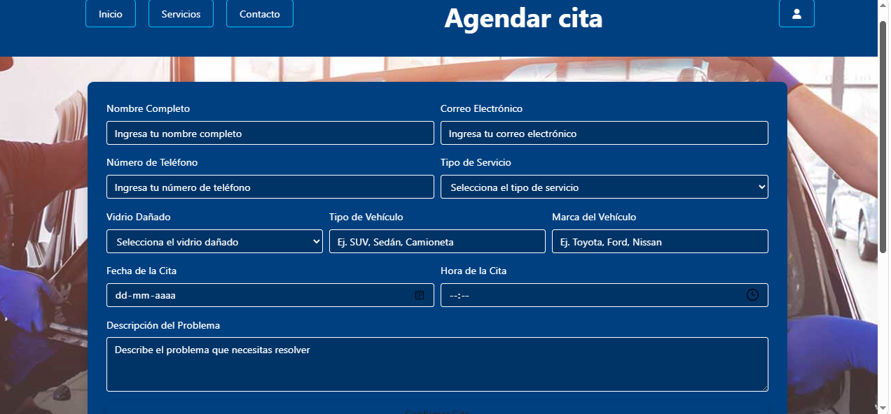

---

### 📞 Contacto

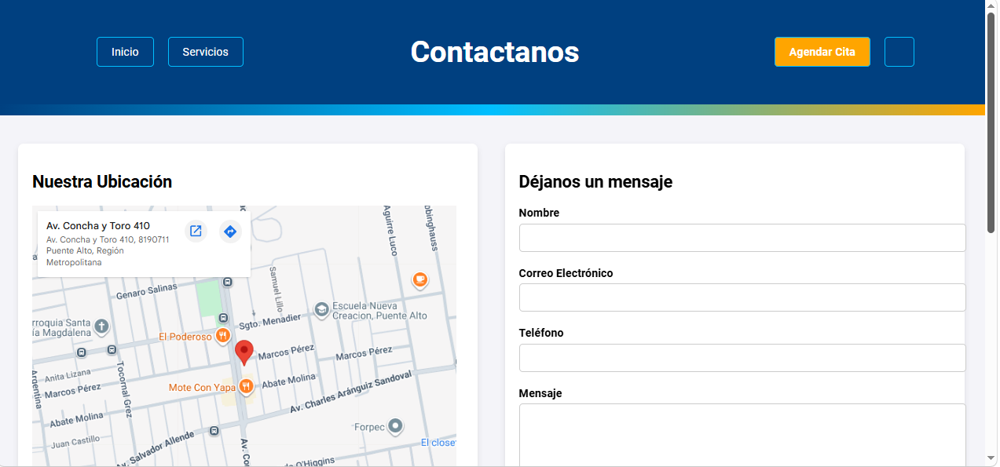

---

### 🔐 Inicio de sesión

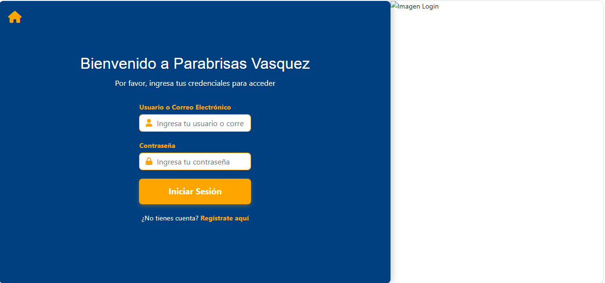

---

### 👤 Registro de usuarios

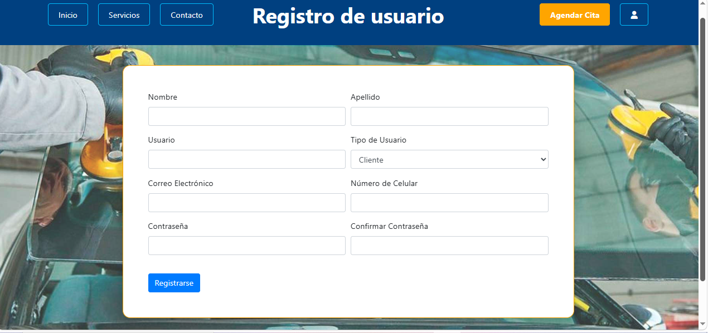

---

## 🚀 Tecnologías utilizadas

### Front-End

- HTML5
- CSS3
- JavaScript
- Responsive Design

### Herramientas

- Visual Studio Code
- Live Server
- Git
- GitHub

### Back-End planteado, no finalizado

- Node.js
- Express.js
- MongoDB
- Mongoose

---

## 📂 Estructura del proyecto

```text
Parabrisas_Vasquez
│
├── public/
│   ├── css/
│   ├── imagenes/
│   └── js/
│
├── views/
├── routes/
├── models/
├── screenshots/
├── app.js
├── server.js
└── package.json
